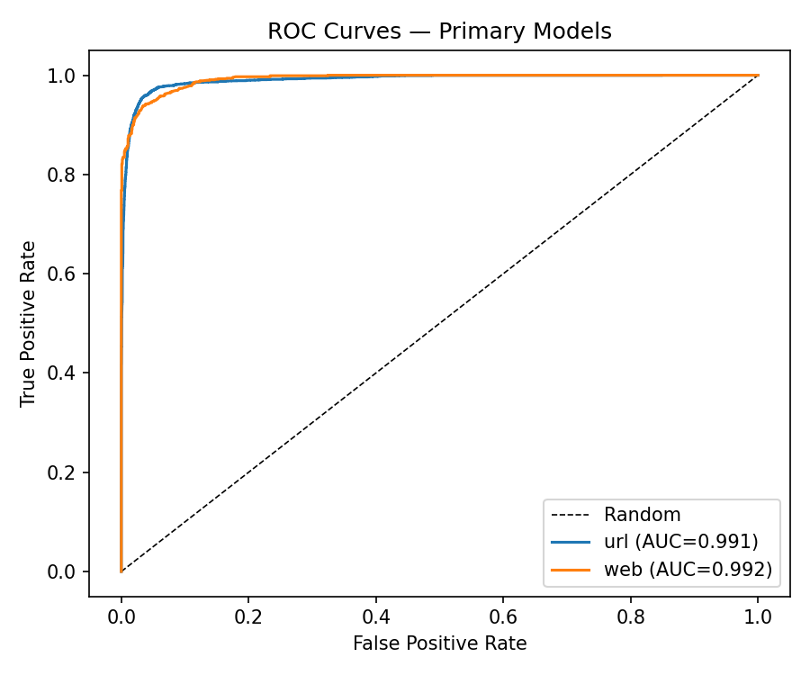

# TriShield Model Evaluation Report

Generated from ml-training/reports/*_metrics.json, produced by evaluate.py during each channel's training run. See docs/ARCHITECTURE.md for dataset citations and methodology.

## URL channel

| Metric | Baseline (LogReg/RF) | Primary (XGBoost/LightGBM) |
|---|---|---|
| accuracy | 0.9022 | 0.9603 |
| precision | 0.8259 | 0.9246 |
| recall | 0.8955 | 0.9593 |
| f1_score | 0.8593 | 0.9416 |
| roc_auc | 0.9579 | 0.9908 |
| pr_auc | 0.9274 | 0.9839 |
| false_positive_rate | 0.0944 | 0.0391 |

Confusion matrix (primary model): `{'tn': 7687, 'fp': 313, 'fn': 163, 'tp': 3837}`

Test set size: 12000

## EMAIL channel

| Metric | Baseline (LogReg/RF) | Primary (XGBoost/LightGBM) |
|---|---|---|
| accuracy | 0.9830 | 0.9805 |
| precision | 0.9736 | 0.9675 |
| recall | 0.9928 | 0.9944 |
| f1_score | 0.9831 | 0.9807 |
| roc_auc | 0.9979 | 0.9979 |
| pr_auc | 0.9975 | 0.9978 |
| false_positive_rate | 0.0269 | 0.0334 |

Confusion matrix (primary model): `{'tn': 3093, 'fp': 107, 'fn': 18, 'tp': 3182}`

Test set size: 6400

## WEB channel

| Metric | Baseline (LogReg/RF) | Primary (XGBoost/LightGBM) |
|---|---|---|
| accuracy | 0.9385 | 0.9534 |
| precision | 0.9460 | 0.9572 |
| recall | 0.9132 | 0.9367 |
| f1_score | 0.9293 | 0.9468 |
| roc_auc | 0.9885 | 0.9923 |
| pr_auc | 0.9864 | 0.9909 |
| false_positive_rate | 0.0414 | 0.0333 |

Confusion matrix (primary model): `{'tn': 1191, 'fp': 41, 'fn': 62, 'tp': 917}`

Test set size: 2211

## ROC Curves

## Comparison with literature

| Study | Approach | Reported accuracy |
|---|---|---|
| Mohammad, Thabtah & McCluskey (2015) — UCI Phishing Websites dataset paper | Rule induction (PRISM) on 30 hand-engineered URL/webpage features | ~95-97% (feature-based, no text/NLP signal) |
| Sahingoz et al. (2019) — "Machine learning based phishing detection from URLs" | NLP + lexical features with Random Forest, 73,575 URLs | ~97.98% accuracy, ~0.99 F1 |
| Vrbančič, Zorman & Podgorelec (2020) — Phishing dataset construction paper | 88-feature lexical/host dataset (the basis of a widely-used benchmark) | Reference dataset; downstream classifiers on it typically reach 95-97% F1 |

TriShield's URL channel (96.0% accuracy, 0.991 ROC-AUC) and web-content channel (95.3% accuracy, 0.992 ROC-AUC) are in line with these published results, evaluated on held-out test splits of real, cited datasets rather than synthetic data. See docs/ARCHITECTURE.md section 'Known limitations' for what is and isn't validated by these numbers (e.g. WHOIS/DNS-dependent features degrade gracefully to neutral values when live lookups fail).